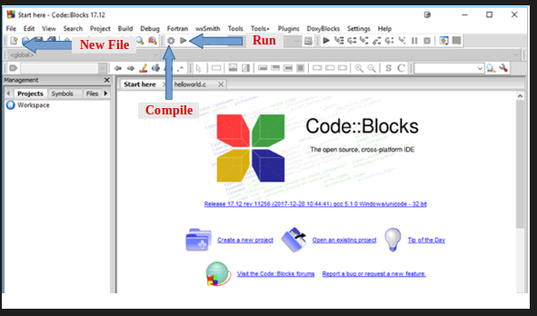

If you had a little knowledge about any of the programming language then this blog is not for you. It is for absolute beginners who have never heard of programming.

---

###Let’s start
If you know nothing then you must have one of the following questions -

1. Why should I learn a programming language?
2. When I am the one who is writing the program and I know how to do that task then why should I write a program for it ?

We will understand the answer for both the question together as we proceed. Please read it completely and don’t skip the parts.

For your knowledge we will start learning **C** language. But for now just forget about these things. First of all you need a platform where you run your code. You can install any IDE (no worries if you never heard of this word) OR you can use an online one.

###Setting up the environment
As an IDE you can use CodeBlocks. Follow the steps [here](https://www.guru99.com/c-gcc-install.html). _It is highly recommended not to use any of the online IDE now!_

If you have followed the steps correctly then it’s the time to _write your first program_ -

1. Open codeblocks and create a new file.



2. Copy and paste the following code

```c
#include <stdio.h>

int main(){
	printf("Hello World!");
	return 0;
}
```

3. save the file and compile it (see the figure above)
4. Run the code.

You will see **Hello World!** on the screen.

Now, look at the above code. Currently you need not to understand the whole thing. **Just understand that you will write your code inside the curly braces**


You must have question that What is the meaning of the lines written by you and what does it do ?

Currently, we will not understand each and every line of the above code. Just keep in mind that the above are neccessary lines for writing any code.

####Template


So, this is the template for now. **You should write atleast these lines in your every program.**

###A brief about `printf`
Now, to print anything on the screen we have to use `printf`.
We have to write the line we want to print in the double quotes inside printf.

The syntax is : `printf(“......”);`

Notice the **semicolon(`;`)** at the end. It denotes the end of current statement (treat it as end of a command). Without this you will get a compilation error. (Don’t worry we will talk about compilation word later).

As some of you might have noticed that what if we want to print a new line. Something like

```
I am learning how to code.
It is quite easy!
```

So, one can come up with a solution like this

```c
#include <stdio.h>

int main(){
  printf("I am learning how to code.");
  printf("It is quite easy!");
  return 0;
}
```

But if you run the code then the output wiil be -

`I am learning how to code.It is quite easy!`

Another solution one can think of is

```c
#include <stdio.h>

int main(){
  printf("I am learning how to code.
  It is quite easy!");
  return 0;
}
```

But the above code is wrong and it won't compile! The reason is simple - _the starting and ending quotes must be on the same line._

So, here comes something called **Escape Characters**. These are nothing but some special symbol which we won't be able to print directly. This includes _new line_, _backspace_ and many more!

So, you can think of them as an **alias**(something which represents something). Like -

- `\n` for printing a **new line**

* `\b` for printing a **backspace**

So, the solution to the original question is -

```c
#include <stdio.h>

int main(){
  printf("I am learning how to code.\n");
  printf("It is quite easy!");
  return 0;
}
```

**Now, some of you might be thinking what if we want to print `\n` itself on the screen?**

Simple - for that we have to use another escape character ;).

For, printing a `\` on the screen we have to use `\\`! So, for printing `\n \b` the code will be -

```c
#include <stdio.h>

int main(){
  printf("\\n \\b");
  return 0;
}
```

---

#####Summary of the things we did -

- Install an IDE (a place where we run our code).
- Wrote a code, **compile** it and then **run** it.
- Learn what `printf` does.
- Learn about **Escape Characters** and _the way to print the escape characters themselves_!

Go ahead and try printing different things like your name, age, a paragraph, _print all the things your learnt today_, etc :)
